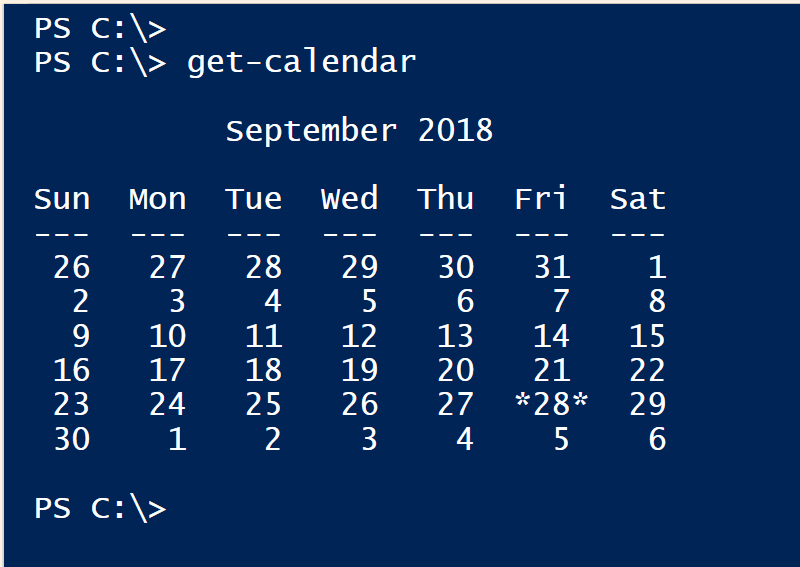
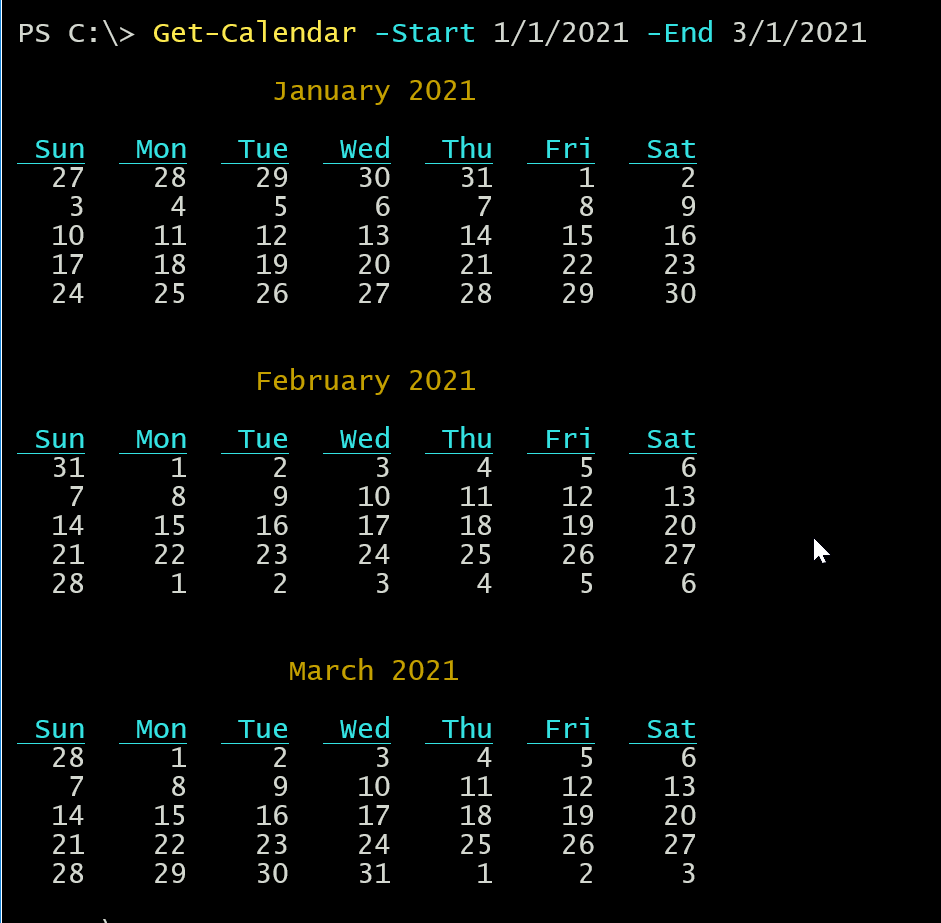
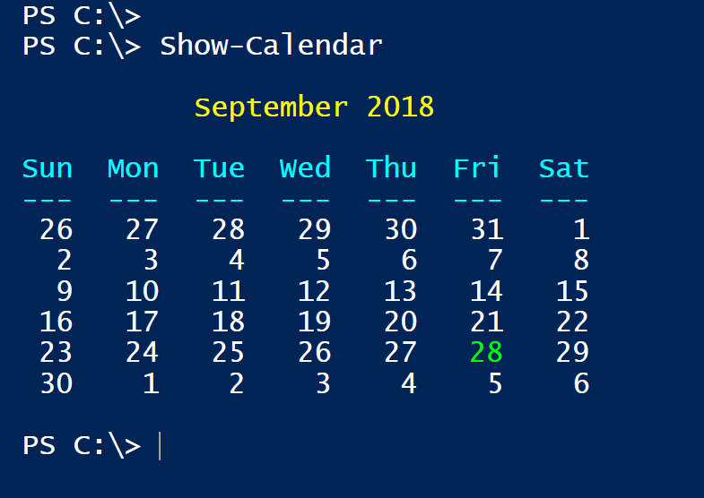

# PSCalendar

[](https://www.powershellgallery.com/packages/PSCalendar/) [](https://www.powershellgallery.com/packages/PSCalendar/)

This module contains a few functions for displaying a calendar in the PowerShell console. The primary function is based on code originally published by Lee Holmes at [http://www.leeholmes.com/blog/2008/12/03/showing-calendars-in-your-oof-messages/](http://www.leeholmes.com/blog/2008/12/03/showing-calendars-in-your-oof-messages/)
.

You can install this module from the PowerShell Gallery.

```powershell
Install-Module PSCalendar [-scope currentuser]
```

It has been tested on PowerShell Core both under Windows and Linux and there is no reason these commands should not work, except for [Show-GuiCalendar](docs/Show-GuiCalendar.md).

## [Get-Calendar](docs/Get-Calendar.md)

The commands in this module have been updated to take advantage of new features in Windows PowerShell. The main function, [Get-Calendar](docs/Get-Calendar.md), will display the current month in the console, highlighting the current date with asterisks.



But you can also specify a calendar by month and year.


In this example you can see that I specified dates to highlight. Or you can specify a range of months.



The function should be culturally aware. The commands in this module that have a `-Month` parameter should autocomplete to culture specific month names.


There is a similar autocompletion for `-Year` that begins with the current year and then the next 5 years. Although nothing prevents you from entering any year you want.

## [Show-Calendar](docs/Show-Calendar.md)

The module also contains a command to write a colorized version of the calendar to the console host. Whereas `Get-Calendar` writes a string to the pipeline, `Show-Calendar` writes directly to the host using `Write-Host`.



This command is in essence a "wrapper" function for `Get-Calendar`.


*Note: Starting with version 1.5.1, the current day will be highlighted in Red, although you can modify that via the TodayColor parameter. I did not update the screen shots.*

## [Show-GUICalendar](docs/Show-GuiCalendar)

Finally, you can display a graphical calendar using a WPF-based script. The function runs the calendar-related code in a runspace so it does not block your prompt. You can display up to 3 months and specify dates to highlight.

```powershell
PS C:\> Show-GuiCalendar 12/2018 2/2019 -highlight 12/24/18,12/25/18,12/31/18,1/1/19,1/18/19,2/14/19,2/22/19
```


The calendar form is transparent. But you should be able to click on it to drag it around your screen. You can also use the + and - keys to increase or decrease the calendar's opacity. Be aware that if you close the PowerShell session that launched the calendar, the calendar too will close. This function requires Windows PowerShell.

_last updated 15 March 2019_
